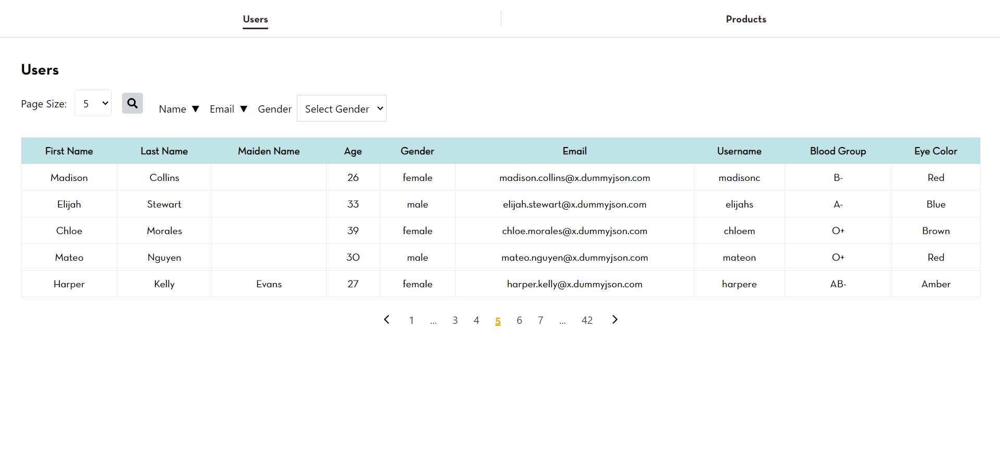
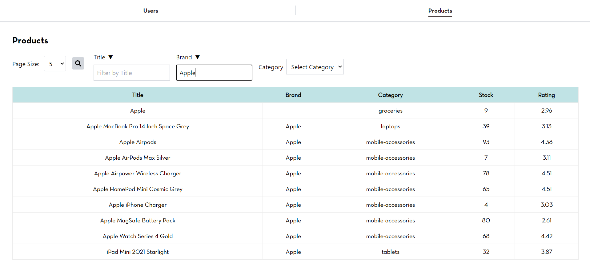

**React Front-End**

**Folder Structure and Component Design**
- Organized the project into a structured folder hierarchy to enhance maintainability and scalability (fonts, components, context, and pages)
- Developed reusable components (Navbar, Pagination, PageSizeDropdown, SearchBar)

**Data Management**
- Created a DataContext to efficiently manage user and product data across the application

**Data Fetching**
- Used axios library to fetch data from the https://dummyjson.com

**Pagination**
- Integrated pagination to navigate through the product listings, including a dropdown component to select page size

**Search Functionality**
- Implemented a client-side search feature that allows users to search for users and products by matching the string with all the columns

**Server-Side Filtering** 
- Applied server-side filters using the API documentation from DummyJSON to allow users to filter user and products based on specific attributes

**User Interface and Styling** 
- Styled the application as per the provided example and some enhancements

**Instructions**

- Clone the GitHub repository https://github.com/moizmasood10/astudio-react
- Run npm install
- Run npm run dev

